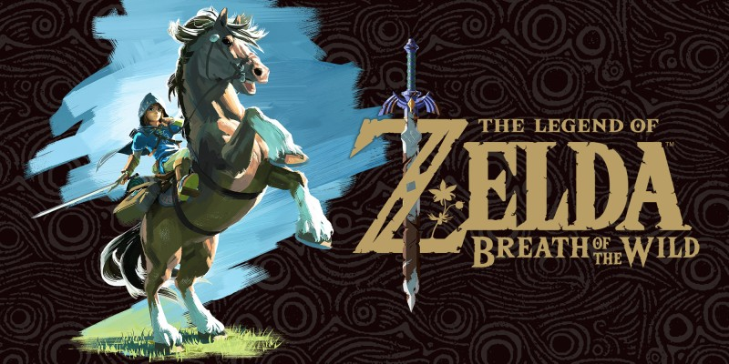
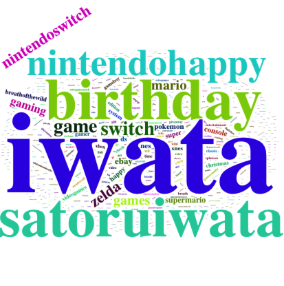
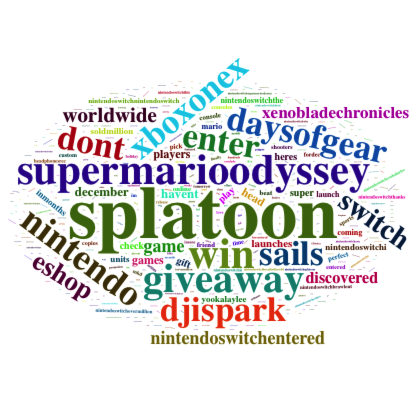

---
title: "Video Game Market Evaluation"
author: "Chen Jing"
date: "12/08/2017"
output: pdf_document
---
  
  
  
```{r, warning=FALSE, message=FALSE, echo=FALSE}
library(dplyr)
library(ggplot2)
library(knitr)
require(reshape2)
library(treemap)
library(tidyr)
library(wordcloud2)
library(stringr)
library(RColorBrewer)
library(tidytext)
library(tidyverse)
library(janeaustenr)
library(scales)
library(ggmap)
library(xlsx)

```
```{r,warning=FALSE, message=FALSE, echo=FALSE}
setwd('/Users/JingC/Desktop/MA 615/Final project/')

#Game <- read.csv('Video_Games_Sales_as_at_22_Dec_2016.csv')
Game <- read.xlsx("Video_Games_Sales_as_at_22_Dec_2016.xlsx", sheetName = "GameSales")
#NintendoData <- read.csv('NintendoData.csv', stringsAsFactors=FALSE)
NintendoData <- read.xlsx('NintendoData.xlsx', sheetName = "NintendoData", stringsAsFactors=FALSE)
Game$Year_of_Release<-as.numeric(as.character(Game$Year_of_Release))
```


#Introduction 
A video game is an electronic game that involves interaction with a user interface to generate visual feedback on a video device such as a TV screen or computer monitor. Recently, Newzoo released the latest quarterly update of its Global Games Market Report. It shows that 2.2 billion gamers across the globe are expected to generate $108.9 billion in game revenues in 2017. In this report, we will review the video game market through datasets provides by Metacritic.com and live topic-related text data from Twitter.com. 


#Background
The popularity of a video game is timeliness. The Hot Sale period for certain video game is usually only months long, most video games weed out from the market in less than one year. Thus, Video Game is a very competitive marketing.In order to better understand the video game business, we will review some characteristics of video game. A video game, like most other forms of media, may be categorized into genres. Video game genres are used to categorize video games based on their gameplay interaction rather than visual or narrative differences. The electronic systems used to play video games are known as platforms; examples of these are personal computers and video game consoles. Video game development and authorship, much like any other form of entertainment, is frequently a cross-disciplinary field, the developer will be generated as publishers in the dataset from Metacritic.com. 

#Video Game Market Review 
The Video Game data is provided by Metacritic.com which includes over 16000 games from 1980 to 2016 and their related information such as game name, platform, year of release, genre, publisher, and global sales. The following table represent as a sample of the dataset, and also the top 10 global sales game from the Metacritic dataset. 

```{r echo = FALSE}
top.10<-subset(Game[c(1:10),],select=c(Name,Platform,Genre,Publisher,Global_Sales))
knitr::kable(top.10)
```

As we could observe from the above time, the top 10 best sell game are varying in platform, genre, but they are all from the same publisher -- Nintendo. Nintendo is a Japanese multinational consumer electronics and video game company headquartered in Kyoto. It is one of the world's largest video game companies by market capitalization, creating some of the best-known and top-selling video game franchises, such as Mario, The Legend of Zelda, and Pokémon.

{width=120px}
{width=240px}
{width=240px}

Nintendo indeed has some significant top level video game productions. Market share is one of the important indicator in Marketing evaluation. Does Nintendo also stay the topest by compare market share with other Game Publisher? 


##Video Game Publisher
Through 1980 to 2016, the top 10 publishers for overall sales video game are list in the following table. 
```{r,warning=FALSE, message=FALSE, echo=FALSE}
GamePublisher<-Game %>% group_by(Publisher) %>% 
summarise(Total.Sales = sum(Global_Sales),Avg.Sales=mean(Global_Sales)) %>% arrange(desc(Total.Sales)) %>%
top_n(n = 10, wt = Total.Sales)
kable(GamePublisher)
```

```{r,warning=FALSE, message=FALSE, echo=FALSE,fig.height=4,fig.width=12}

GP <- ggplot(GamePublisher, aes(x=reorder(Publisher, -Total.Sales), y=Total.Sales))+geom_bar(stat = "identity")+labs(x = "Publisher", y="Sales (in millions)")+ggtitle('Top 10 Overall Sales Publishers')+ theme(plot.title = element_text(size = 30, face = "bold"))
GP
```

From the bargraph, we could obeserve that Nintendo has a significant higher overall game sales compare to other video game publishers. 


```{r,warning=FALSE, message=FALSE, echo=FALSE,fig.height=4,fig.width=12}
PublisherSale<-Game[c(which(Game$Publisher=='Nintendo'),which(Game$Publisher=='Electronic Arts'),which(Game$Publisher=='Activision'),which(Game$Publisher=='Sony Computer Entertainment'),which(Game$Publisher=='Ubisoft'),which(Game$Publisher=='Take-Two Interactive'),which(Game$Publisher=='THQ'),which(Game$Publisher=='THQ'),which(Game$Publisher=='Konami Digital Entertainment'),which(Game$Publisher=='Sega'),which(Game$Publisher=='Namco Bandai Games')),]

OSale <- ggplot(PublisherSale, aes(x = Publisher, y = Global_Sales)) +
geom_boxplot()+ggtitle('Top 10 Overall Sales Publishers')+ theme(plot.title = element_text(size = 30, face = "bold"))
OSale
```
Besides overall revenue, from the boxplot above, Nintendo also shows the highest distribution of global sales for each of their video game. However, the boxplot also indicate that the gloabl sales for most video games is extremely low (less than 1 million dollars)

```{r,fig.align="center",warning=FALSE, message=FALSE, echo=FALSE,fig.height=3,fig.width=4}
qplot( Game$Global_Sales,seq_along(Game$Global_Sales),xlab='Gobal Sales',ylab='Frequency')
```

The frequency plot prove the same conclusion from the boxplot. For 16719 games data collected from Metacritic.com, over 15000 games have global sales less than 1 million. It is challenge for company to success in Video Game market. 


##Video Game Genre
Video game genres are used to categorize video games based on their gameplay interaction rather than visual or narrative differences.Unlike individual game, each game genre has some game developer. 
```{r,fig.align="center",warning=FALSE, message=FALSE, echo=FALSE,fig.height=3,fig.width=5}
treemap(Game,
index="Genre",
vSize="Global_Sales",
type="index",
title="Overall Video Games Sales for Various Genre ", #Customize your title
fontsize.title = 14 #Change the font size of the title
)


```

From the treemap above, the hottest game genre is Action, however, other types of genre still have significant proportions in the video game marketing. 

##Video Game Platform 
The electronic systems used to play video games are known as platforms. With the development of the game design, the graphic, sound, control technologies are changing in a short period in order to provides the best game service to the customers. 

```{r,warning=FALSE, message=FALSE, echo=FALSE,fig.height=4,fig.width=12}
PYear<-Game[-c(which(Game$Year_of_Release=='2017'),which(Game$Year_of_Release=='2020'),which(Game$Year_of_Release=='N/A'),which(Game$Genre=='')),]
PlatYear<-PYear[c(which(PYear$Platform=='PS2'),which(PYear$Platform=='X360'),which(PYear$Platform=='PS3'),which(PYear$Platform=='Wii'),which(PYear$Platform=='DS'),which(PYear$Platform=='PS')),]

platform.year <-ggplot(PYear, aes(Year_of_Release, Global_Sales))+geom_bar(stat = "identity", aes(fill = Platform))+ggtitle('Platform sales change over time')+ theme(plot.title = element_text(size = 30, face = "bold")) 
platform.year
```

From the barplot above, most of the video game platform only stay in market for couple years. But, for some popular game platform, it could last for more than five years. Let's have a closer look. 

```{r,warning=FALSE, message=FALSE, echo=FALSE,fig.height=4,fig.width=8}
platform.year <-ggplot(PlatYear, aes(Year_of_Release, Global_Sales))+geom_bar(stat = "identity", aes(fill = Platform))+ggtitle('Most Popular Platform sales change over time')+ theme(plot.title = element_text(size = 20, face = "bold")) 
platform.year
```

Most popular game platform could still alive in marketing for more than five years. In fact, the most popular game platform are also develop and make from the toppest video game publishers. Thus, enough high quailty video games is necessary for sell well patform. 


###Nintendo Evaluation
Among the above popular game platform, DS and Wii are produced by game company Nintendo. However, as we could see from the plot, the overall sales for the two platform keep decreseaing since 2007. Does this indicate that Nintendo beign to lose in the game market? 
  
  
  ```{r,warning=FALSE, message=FALSE, echo=FALSE,fig.height=6,fig.width=15}
PYear<-Game[-c(which(Game$Year_of_Release=='2017'),which(Game$Year_of_Release=='2020'),which(Game$Year_of_Release=='N/A'),which(Game$Genre=='')),]
PubYear<-PYear[c(which(PYear$Publisher=='Nintendo'),which(PYear$Publisher=='Electronic Arts'),which(PYear$Publisher=='Activision'),which(PYear$Publisher=='Sony Computer Entertainment')),]


GamePub <-ggplot(PubYear, aes(Year_of_Release, Global_Sales))+geom_bar(stat = "identity", aes(fill = Publisher)) +ggtitle('Most Popular Publisher sales change over time')+ theme(plot.title = element_text(size = 30, face = "bold")) 
GamePub
```
From the above plot, Nintendo is monopolized game market around 1985, but after the powerful companies such as Sony,Activision, and Electronic Arts joined the market. Nintendo's market share keep falling in the recent year. 


#Nintendo in 2017 
For most of the gamer born in the 1990s, SuperMario and Pokemon defined the fun time in their childhood. The following section states the recent review for the game company Nintendo. In order to catch up the real-time dynamic for Nintendo. I collected tweet data from twitter that related to Nintendo. So, reader could observe the lastest trend of Nintendo. The Nintendo tweet data includes over 100000 tweets with # related to Nintendo, with variable such as tweets texts, longitude, latitude, created time.

##Location
```{r,fig.align="center",warning=FALSE, message=FALSE, echo=FALSE}

latitude <- na.omit(NintendoData$latitude)
longitude <- na.omit(NintendoData$longitude)

mapdat<-data.frame(latitude,longitude)

mp <- NULL
mapWorld <- borders("world", colour="gray50", fill="gray50") # create a layer of borders
mp <- ggplot() +   mapWorld

#Now Layer the cities on top
mp <- mp+geom_point(data = mapdat,aes(x = longitude, y = latitude), size = 1, alpha = 1, color = "#f768a1")   +xlab("Longitude")+ylab("Latitude")+ggtitle("Nintendo worldwides of tweets ")+theme(plot.title = element_text(color = "black",size = 14,face = "bold"),legend.position = ("right"))+expand_limits(y = c(-50,75))

mp
```
Even though, the tweet dataset is over 100000, the location information for most tweets is unknown, only 81 location observations have been collected. Among the limit observation, most tweet were wrote in the North America and Europe. Because of the small amount of dataset, we will discover more information from the tweet text. 

#Text Mining

##Word Cloud
{width=240px}

The tweet data was captured in Dec. of 2017. First, I explore how people on Twitter think of Nintendo. By extracting the tweet text messages from the original data frame, I cleaned the text by getting rid of URLs, hashtags, @, unnecessary spaces, retweet headers and meaningless daily words (such as we, can, she, able, etc.). Package “wordcloud2” was used to generate the word cloud here. From the word cloud we could see that postive word such as happy, birthday are mentioned a lot in the tweet text. The former company CEO Satoru Iwata was also appeared pretty frequent. It seems Nintendo brought many postive attitude with customers. 

```{r, warning=FALSE, message=FALSE, echo=FALSE, eval=FALSE}
Nintendo<-NintendoData[c(which(NintendoData$tweets=='nintendo')),]
Nintendotweet<-as.vector(data.frame(Nintendo[[3]]))
Nintendotweet <- sapply(Nintendotweet, function(row) iconv(row, "latin1", "ASCII", sub=""))
Nintendo_text <- paste(Nintendotweet,collapse = "")

# Clean text
clean_tweet = gsub("&amp", "", Nintendo_text)
clean_tweet = gsub("(RT|via)((?:\\b\\W*@\\w+)+)", "", clean_tweet)
clean_tweet = gsub("@\\w+", "", clean_tweet)
clean_tweet = gsub("[[:punct:]]", "", clean_tweet)
clean_tweet = gsub("[[:digit:]]", "", clean_tweet)
clean_tweet = gsub("http\\w+", "", clean_tweet)
clean_tweet = gsub("[ \t]{2,}", "", clean_tweet)
clean_tweet = gsub("^\\s+|\\s+$", "", clean_tweet) 
clean_tweet <- str_replace_all(clean_tweet," "," ")#get rid of unnecessary spaces
#clean_tweet <- str_replace_all(clean_tweet, "http://t.co/[a-z,A-Z,0-9]*{8}","") # Get rid of URLs
clean_tweet <- str_replace(clean_tweet,"RT @[a-z,A-Z]*: ","") # Take out retweet header
clean_tweet <- str_replace_all(clean_tweet,"#[a-z,A-Z]*","") # Get rid of hashtags
clean_tweet <- str_replace_all(clean_tweet,"@[a-z,A-Z]*","")# Get rid of references to other screennames 


Nintendo_df <- data_frame(text = clean_tweet)

Nintendo_df<-Nintendo_df %>% unnest_tokens(word, text)


Nintendo.tweet<-Nintendo_df %>%
anti_join(stop_words) %>%
count(word, sort=TRUE) 

wordcloud2(data = Nintendo.tweet)


```
##Sentiment Analysis
In order to evaluate customers' tweet attitude, sten sentiment test is applied in the following. Postive word such as thank, super, and happy are used quite often in tweets. And most of the negative words for example wild, crushing, and smash are usually part of the video game material. In general, people from twitter have a strong postive attituide related to Nintendo. 

```{r, warning=FALSE, message=FALSE, echo=FALSE,fig.height=3,fig.width=6}
Nintendo<-NintendoData[c(which(NintendoData$tweets=='nintendo')),]
Nintendotweet<-as.vector(data.frame(Nintendo[[3]]))
Nintendotweet <- sapply(Nintendotweet, function(row) iconv(row, "latin1", "ASCII", sub=""))
Nintendo_text <- paste(Nintendotweet,collapse = "")
clean_tweet = gsub("&amp", "", Nintendo_text)
clean_tweet = gsub("(RT|via)((?:\\b\\W*@\\w+)+)", "", clean_tweet)
clean_tweet = gsub("@\\w+", "", clean_tweet)
clean_tweet = gsub("[[:punct:]]", "", clean_tweet)
clean_tweet = gsub("[[:digit:]]", "", clean_tweet)
clean_tweet = gsub("http\\w+", "", clean_tweet)
clean_tweet = gsub("[ \t]{2,}", "", clean_tweet)
clean_tweet = gsub("^\\s+|\\s+$", "", clean_tweet) 
clean_tweet <- str_replace_all(clean_tweet," "," ")#get rid of unnecessary spaces
#clean_tweet <- str_replace_all(clean_tweet, "http://t.co/[a-z,A-Z,0-9]*{8}","") # Get rid of URLs
clean_tweet <- str_replace(clean_tweet,"RT @[a-z,A-Z]*: ","") # Take out retweet header
clean_tweet <- str_replace_all(clean_tweet,"#[a-z,A-Z]*","") # Get rid of hashtags
clean_tweet <- str_replace_all(clean_tweet,"@[a-z,A-Z]*","")# Get rid of references to other screennames 


Nintendo_df <- data_frame(text = clean_tweet)

Nintendo_df<-Nintendo_df %>% unnest_tokens(word, text)


Nintendo.tweet<-Nintendo_df %>%
anti_join(stop_words) %>%
count(word, sort=TRUE) 


janeaustensentiment <- Nintendo_df  %>%
inner_join(get_sentiments("bing")) 


bing_word_counts <-  Nintendo_df %>%
inner_join(get_sentiments("bing")) %>%
count(word, sentiment, sort = TRUE) %>%
ungroup()


bing_word_counts %>%
group_by(sentiment) %>%
top_n(10) %>%
ungroup() %>%
mutate(word = reorder(word, n)) %>%
ggplot(aes(word, n, fill = sentiment)) +
geom_col(show.legend = FALSE) +
facet_wrap(~sentiment, scales = "free_y") +
labs(y = "Contribution to sentiment",
x = NULL) +
coord_flip()

```

##Frequency Analysis

In this section, I did further frequency analysis of tweet texts in terms of number of characters per tweet, word length per tweet, number of unique words per tweet, number of hashtag per tweet, number of @mentions per tweet.
I explored people’s habits about writing tweet texts. It can be seen that as the number of words increases in one tweet, the number of character increases but the size of words per tweet decreases. These two patterns might be similar as the overall writing patterns in Twitter. 

```{r, warning=FALSE, message=FALSE, echo=FALSE,fig.height=3,fig.width=6}
chars_per_tweet = sapply(Nintendotweet, nchar)

words_list = strsplit(Nintendotweet, " ")

# words per tweet
words_per_tweet = sapply(words_list, length)

# length of words per tweet
wsize_per_tweet = sapply(words_list, function(x) mean(nchar(x)))

uniq_words_per_tweet = sapply(words_list, function(x) length(unique(x)))

# how many hashtags per tweet
hash_per_tweet = sapply(words_list, function(x) length(grep("#", x)))


# how many @mentions per tweet
ats_per_tweet = sapply(words_list, function(x) length(grep("@", x)))


# combine all into a data frame
text_freq_df = data.frame(
  chars=chars_per_tweet,
  words = words_per_tweet,
  lengths = wsize_per_tweet,
  uniqs = uniq_words_per_tweet,
  hashs = hash_per_tweet,
  ats = ats_per_tweet)

# words -vs- chars
ggplot(text_freq_df, aes(x=words, y=chars)) +
  geom_point(colour="blue", alpha=0.2) +
  stat_smooth(method="lm",colour="red") +
  labs(x="number of words per tweet", y="number of characters per tweet") +
  ggtitle ("Number of words -vs- Number of characters") + 
  theme(plot.title = element_text(size=12))

```

```{r, warning=FALSE, message=FALSE, echo=FALSE,fig.height=3,fig.width=6}
# words -vs- word length
ggplot(text_freq_df, aes(x=words, y=lengths)) +
  geom_point(colour="blue", alpha=0.2) +
  stat_smooth(method="lm",colour = "red",se = TRUE) +
  labs(x="number of words per tweet", y="size of words per tweet") +
  ggtitle("Number of words -vs- Length of words")+
  theme(plot.title = element_text(size=12))
```

#Discussion 
Twitter has been use as data resource to measure customer behavior for Nintendo in this project. Is twitter timely reflect the customer attitude? Let's check. 

In 2017, Nintendo release its lastest platform 'Nintendo Switch', til the end of 2017, according to Nintendo yearly sales report, the top three best selling game are Zelda Breath of the Wild, Splatoon, and SuperMario. Based on the word cloud from twitter, all three best selling game are appeared in the cloud. Thus, Twitter is timely and fashionable in order to evualate game marketing. 

{width=240px}

```{r, warning=FALSE, message=FALSE, echo=FALSE, eval=FALSE}
Nintendo<-NintendoData[c(which(NintendoData$tweets=='nintendoswitch')),]
Nintendotweet<-as.vector(data.frame(Nintendo[[3]]))
Nintendotweet <- sapply(Nintendotweet, function(row) iconv(row, "latin1", "ASCII", sub=""))
Nintendoreview_text <- paste(Nintendotweet,collapse = "")

# Clean text
clean_tweet = gsub("&amp", "", Nintendoreview_text)
clean_tweet = gsub("(RT|via)((?:\\b\\W*@\\w+)+)", "", clean_tweet)
clean_tweet = gsub("@\\w+", "", clean_tweet)
clean_tweet = gsub("[[:punct:]]", "", clean_tweet)
clean_tweet = gsub("[[:digit:]]", "", clean_tweet)
clean_tweet = gsub("http\\w+", "", clean_tweet)
clean_tweet = gsub("[ \t]{2,}", "", clean_tweet)
clean_tweet = gsub("^\\s+|\\s+$", "", clean_tweet) 
clean_tweet <- str_replace_all(clean_tweet," "," ")#get rid of unnecessary spaces
#clean_tweet <- str_replace_all(clean_tweet, "http://t.co/[a-z,A-Z,0-9]*{8}","") # Get rid of URLs
clean_tweet <- str_replace(clean_tweet,"RT @[a-z,A-Z]*: ","") # Take out retweet header
clean_tweet <- str_replace_all(clean_tweet,"#[a-z,A-Z]*","") # Get rid of hashtags
clean_tweet <- str_replace_all(clean_tweet,"@[a-z,A-Z]*","")# Get rid of references to other screennames 

text_df <- data_frame(text = clean_tweet)

text_df<-text_df %>% unnest_tokens(word, text)

ase<-text_df %>%
  anti_join(stop_words) %>%
  count(word, sort=TRUE) 

wordcloud2(data = ase)
```


#Conclusion 
As one of the world's largest video game companies, Nintendo still occpuys a significant proportion of game market. Although, Nintendo is no longer the monopoly or leader of the video game market. It still bring customers postitive attituide and a lot of joys. 